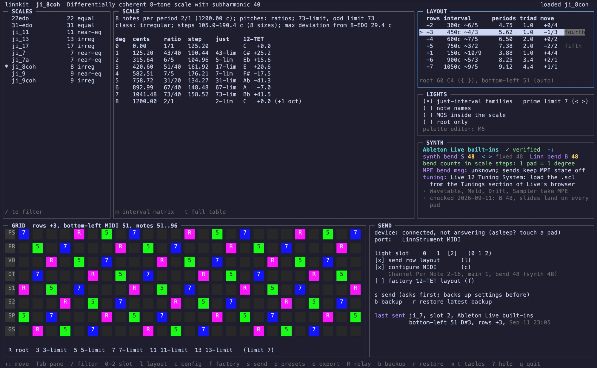

# linnkit



linnkit is a terminal app for the Roger Linn LinnStrument. It reads Scala (`.scl`) scale files. It shows the contents of a scale. It makes a row layout and a light pattern for the scale. It sends them to the LinnStrument.

linnkit works with all types of scale: just intonation, equal divisions (EDO), non-octave scales and irregular scales.

linnkit does not write `.scl` files. It writes `.kbm` files only for synths that need them.

## AI-assisted development

linnkit was made with AI-assisted development. An AI coding assistant helped to write the code and the documentation.

## Requirements

- macOS.
- A LinnStrument (full size, 200 pads). linnkit was tested with firmware 2.3.4.
- A USB connection to the LinnStrument. The MIDI port name must contain `LinnStrument MIDI`.
- To build: Go 1.27 or later and the Xcode command-line tools (the MIDI driver uses cgo).
- A terminal window of 160 × 50 characters or larger.

## Install

1. Clone the repository.
2. Go to the repository folder.
3. Build the app:

   ```
   make build
   ```

4. The app is `bin/linnkit`.

To run the tests, use `make check`.

## Scale folders

linnkit reads `.scl` files from these folders, if they exist:

- `SCL/` in the repository
- `~/SCL`
- the folders that you add with `linnkit folders add DIR`

To see the folders, use `linnkit folders`. To remove a folder, use `linnkit folders remove DIR`.

To use other folders for one session, use `linnkit tui --scales DIR1,DIR2`.

## Start the dashboard

1. Connect the LinnStrument.
2. Touch a pad to wake the LinnStrument. linnkit gets no answer from a LinnStrument that sleeps.
3. Make sure that the LinnStrument shows its normal play surface, not a settings screen.
4. Run `bin/linnkit`.

The dashboard has these panes:

| Pane | Contents |
|---|---|
| SCALES | The list of scale files, with size and type |
| SCALE | The scale summary and the table of degrees |
| LAYOUT | Row offsets for the scale, best first |
| LIGHTS | The light scheme |
| SYNTH | The synth and its pitch-bend range |
| GRID | A preview of the 25 × 8 pads |
| SEND | The light slot and the send options |

Use Tab, or the Left and Right arrows, to go to the next pane. Use the Up and Down arrows to move in a pane. Press `?` to see all keys.

## Keys

| Key | Action |
|---|---|
| ↑ ↓ | Move in the pane |
| Tab, ← → | Go to the next or the previous pane |
| Enter | Load the selected scale |
| `/` | Filter the scale list by name or description |
| `[` `]` | Move the bottom-left note down or up (LAYOUT pane) |
| `{` `}` | Move the root note down or up (LAYOUT pane) |
| `<` `>` | Change the prime limit (LIGHTS pane) or the synth bend range (SYNTH pane) |
| `0` `1` `2` | Select the custom light slot |
| `l` | Send the row layout: on or off |
| `c` | Configure MIDI: on or off |
| `f` | Send the factory 12-TET layout: on or off |
| `s` | Send to the LinnStrument (linnkit asks first) |
| `p` | Open the presets |
| `e` | Export to Madrona Labs synths |
| `R` | Open the tuning relay |
| `g` | Show the grid large: square pads, as big as the window allows, with their labels and scale degrees. Press `g` or Esc to go back. |
| `b` | Back up the LinnStrument settings |
| `r` | Restore the latest backup |
| `m` | Show the interval matrix |
| `t` | Show the full table of degrees |
| `q` | Quit |

## Send a scale to the LinnStrument

1. In SCALES, select a scale. Press Enter.
2. In LAYOUT, select a row offset.
3. In LIGHTS, select a light scheme.
4. In SYNTH, select your synth.
5. In SEND, select a light slot (`0`, `1` or `2`).
6. Press `s`.
7. Read the summary. Press `y` to send, or `n` to cancel.

linnkit then does these steps:

1. It reads all LinnStrument settings and keeps a backup in `~/.config/linnkit/backups`.
2. It sends the MIDI configuration, if "configure MIDI" is on.
3. It sends the row layout, if "send row layout" is on.
4. It paints the light pattern into the light slot and saves the slot.
5. It reads the settings again and compares them with the values that it sent.

**Caution:** A send replaces the light pattern in the slot that you select. Slot 2 is the default.

To go back to the settings before the send, press `r`. Then press `y`.

### Light schemes

| Scheme | Colors |
|---|---|
| Just-interval families | One color for each prime limit (3, 5, 7, 11, 13) |
| Note names | The root, naturals, sharps and flats in different colors |
| MOS inside the scale | The root and the notes of a smaller moment-of-symmetry scale. The other notes are not lit. |
| Root only | The root only |
| Chain of fifths | Colours by the place on the chain of fifths from the root (Lumatone 31-EDO colours). Labels are note names. |
| MOS as white keys | A MOS scale white, all other notes blue, like the keys of a MOS keyboard |
| Wijmenga keyboard | The colours of Wijmenga's microtonal keyboards (meantone and "four seasons" layouts) |
| Kite colour notation | Kite Giedraitis's colours: wa, yo/gu (5), zo/ru (7), ilo/lu (11), tho/thu (13) |
| Prime factors | The primes 3, 5 and 7 in a ratio switch the red, green and blue LEDs. The root is not lit. |
| Step sizes | One colour for each step size, largest white, smallest blue |
| Nested MOS layers | Up to four MOS scales along the generator, one inside the other |
| Consonance | Bands by odd limit: 5 or less white, 9 green, 15 blue, higher cyan. Labels are the ratios. |
| Harmonic series | The harmonics 1–16 (or 16–32) of the root yellow, the subharmonics blue, both white |

In the LIGHTS pane, `<` `>` changes the main setting of the selected scheme: the prime limit, the generator, or the harmonic range. `{` `}` changes the second setting: the MOS size, or subharmonics on or off. linnkit keeps these settings for each scale.

The LinnStrument has 10 colors. Each LED is either on or off for red, green and blue. White, orange, lime and pink are mixes of two colors. Thus, white looks light cyan and pink looks salmon on the pads. The grid preview shows these mixes.

### Factory 12-TET layout

Press `f` to send the layout that the LinnStrument had from the factory:

- Rows are a fourth (5 semitones) apart.
- The bottom-left pad is F#1 (MIDI 30).
- C is cyan. The other natural notes are green.

This send does not change the custom light slots. The LinnStrument does not keep these settings after power-off until you save them. To save them, push and release a control button (for example, Preset) one time after the send.

## Pitch bend and slides

A slide across one pad must change the pitch by one scale step. For this, the LinnStrument Bend Range (B) and the synth per-note bend range (S) must agree:

    one pad of slide = 100 × S / B cents

In SYNTH, select your synth and set S to the value in the synth. linnkit calculates B. With "configure MIDI" on, the send sets B on the LinnStrument.

Example: for 31-EDO with the synth at 12 semitones, B is 31.

For scales with unequal steps, one pad of slide is the average step. The SYNTH pane shows the largest error.

### Synth profiles

| Profile | Tuning | Bend range |
|---|---|---|
| Aalto / Kaivo | `.scl` + `.kbm` in `~/Music/Madrona Labs/Scales/linnkit` | 12, 24, 48 or 96 |
| Pigments | `.scl` (set Reference Note C3 = MIDI 60 when you load it) | 2–96 |
| Surge XT | `.scl` + `.kbm`, or MTS-ESP | 1–96 |
| Plasmonic | MTS-ESP | 1–96 |
| Cypher2 | `.tun` | 48 |
| Ableton Live built-ins | Live 12 Tuning System | 48 (checked) |
| Live tuning + MPE plugin | Live 12 Tuning System | 48 (checked with Noisy 2 and Aalto) |
| Bitwig built-ins / Grid | Micro-pitch device (12 notes or fewer) | 1–96 |
| Legacy (non-MPE) | In the synth | 1–24, One Channel mode |
| Generic MPE | In the synth | 1–96 |

The SYNTH pane shows if linnkit checked the profile on a real synth.

### Ableton Live 12

Use this procedure for plugins in Live, for example Expressive E Noisy 2 or Aalto. Live then tunes the plugin.

1. Load the `.scl` file from the Tunings section of the Live browser.
2. In the plugin, set MPE to on. In Aalto, set "Input protocol" to "MIDI MPE".
3. In the plugin, set the per-note pitch bend range to 48.
4. If the plugin has its own tuning, set it to 12-equal. In Aalto, select "12-equal" in the scale menu of the KEY module.
5. In Live, right-click the title bar of the device. Select "Enable MPE Mode".
6. On the track, make sure that "Bypass Tuning" is off.
7. In linnkit, select "Live tuning + MPE plugin". The send sets B to 48.

**Caution:** Do not use a plugin tuning and a Live tuning together on one track. The plugin then gets the tuning two times.

With a tuning, Live measures pitch bend in scale steps. Thus, B = 48 and S = 48 give one scale step for each pad.

## Presets and saved settings

linnkit keeps the settings of each scale: row offset, bottom-left note, root, reference frequency, light scheme and synth. When you load the scale again, linnkit uses these settings.

linnkit also keeps the last send. When you start linnkit again, it shows the scale, layout, bottom-left note, light scheme, synth and light slot of the last send. The SEND pane shows the bottom-left note, the row offset and the time of the last send. A send that does not get to the LinnStrument does not change this.

A preset keeps a scale, its settings and a light slot under a name.

1. Press `p`.
2. Press `a` to save the current scale as a preset. Type a name. Press Enter.
3. To load a preset, select it and press Enter. A load does not send to the LinnStrument. Press `s` to send.
4. To delete a preset, select it and press `d`. Then press `y`.

linnkit keeps its data in `~/.config/linnkit`. To use a different folder, set `LINNKIT_CONFIG_DIR`.

## Export to Madrona Labs synths

Aalto and Kaivo read scales from `~/Music/Madrona Labs/Scales`. linnkit writes to the `linnkit` subfolder there. In Aalto, the subfolder is a submenu of the scale menu.

1. Load a scale.
2. Press `e`.
3. Set the root with `{` and `}`. Press `h` to type a reference frequency, or `z` for the 12-TET frequency of the root.
4. Press `a` to export all scales in the list, not only the current scale.
5. Press `y` to write the files.

linnkit copies each `.scl` file with no changes. It writes a `.kbm` file with the same name. The `.kbm` file puts degree 0 on the root note and lists all degrees (Aalto needs all degrees).

Aalto reads some `.scl` files differently from the Scala standard. For example, Aalto reads a line as cents if the line contains a period, also in a comment. linnkit does not export these files. The export screen shows the reason.

In Aalto, select the scale from the scale menu in the KEY module, in the "linnkit" submenu.

You can also export from the command line:

    bin/linnkit export SCL/31-edo.scl

Use `-n` to see the files before linnkit writes them.

## Tuning relay for 12-TET instruments

Some instruments have no microtuning function, for example the Kurzweil K2600 and the Hexinverter Mutant Brain. The tuning relay tunes them to the scale on the dashboard.

The relay receives the LinnStrument notes over USB. It sends each note as the nearest 12-TET note with pitch bend. Each note gets its own MIDI channel. The relay sends to a MIDI output, for example the DIN output of an audio interface.

The relay uses these rules:

- A slide across one pad goes to the next scale degree, also in scales with unequal steps.
- Pressure, Y and poly aftertouch go to the channel of their note. Sustain and program changes go to all channels. MIDI clock goes through.
- A new note uses the free channel that was quiet for the longest time. Thus, release tails keep their pitch. If all channels are in use, the relay stops the oldest note.
- The pitch bend range is 24 semitones. At start, the relay sends this range (RPN 0) to each channel.

To use the relay:

1. Load a scale and set the root on the dashboard.
2. In SYNTH, select "linnkit relay". Send to the LinnStrument. The LinnStrument is then in Channel Per Note mode with Bend Range 24.
3. Press `R`.
4. Select the target, the output port and the channels. Use the Up and Down arrows to select a line. Use the Left and Right arrows to change it.
5. Set up the target as the relay window shows.
6. Press Space to start the relay.

Press Esc to close the window. The relay continues, and the header shows "relay". Press Space in the relay window to stop the relay. When you quit linnkit, the relay stops all notes.

If you change the scale, the root or the reference frequency on the dashboard, the relay uses the change immediately.

| Target | Channels | Setup on the instrument |
|---|---|---|
| Kurzweil K2600 | 1–16 | MIDI receive mode Multi. The same program on each channel. Pitch bend range 24 semitones. No intonation table. |
| Mutant Brain | 1–4 | Note inputs 1–4 on channels 1–4, last-note priority, pitch bend ±24. CV A–D from note inputs 1–4. Notes outside MIDI 24–120 are not sent. |
| Generic 12-TET synth | 1–16 | The same sound on each channel. Pitch bend range 24 semitones. |

The relay settings stay in `~/.config/linnkit/config.json`.

## Command-line tools

| Command | Action |
|---|---|
| `linnkit describe [--matrix] FILE...` | Show the contents of scale files |
| `linnkit grid [flags] FILE` | Show the grid for a scale as text |
| `linnkit device ports` | Show the MIDI ports |
| `linnkit device read [NUM...]` | Read LinnStrument settings |
| `linnkit device backup FILE` | Save all settings to a file |
| `linnkit device restore FILE` | Write the settings from a file |
| `linnkit send --slot N [--layout] [--configure] FILE` | Send a scale without the dashboard |
| `linnkit export [-n] FILE...` | Copy scales and `.kbm` files to `~/Music/Madrona Labs/Scales/linnkit` |
| `linnkit folders [add\|remove DIR]` | Show, add or remove scale folders |

## Troubleshooting

| Problem | Cause and remedy |
|---|---|
| "the LinnStrument did not answer" | The LinnStrument sleeps. Touch a pad and try again. |
| The lights do not change | The LinnStrument shows a settings screen. Go to the play surface and send again. |
| The lights are old after you load a LinnStrument preset | The LinnStrument does not update custom lights on preset load. Select the light slot again, or send again. |
| Slides do not stop on the next pad | B and S do not agree, or the synth does not use the scale. Check the SYNTH pane and the tuning in the synth. |
| In Aalto, degree 0 is on A4 | The `.kbm` file is missing or empty. Export the scale again with `e`. |
| "linnkit needs at least 160x50" | Make the terminal window larger, or make the font smaller. |
